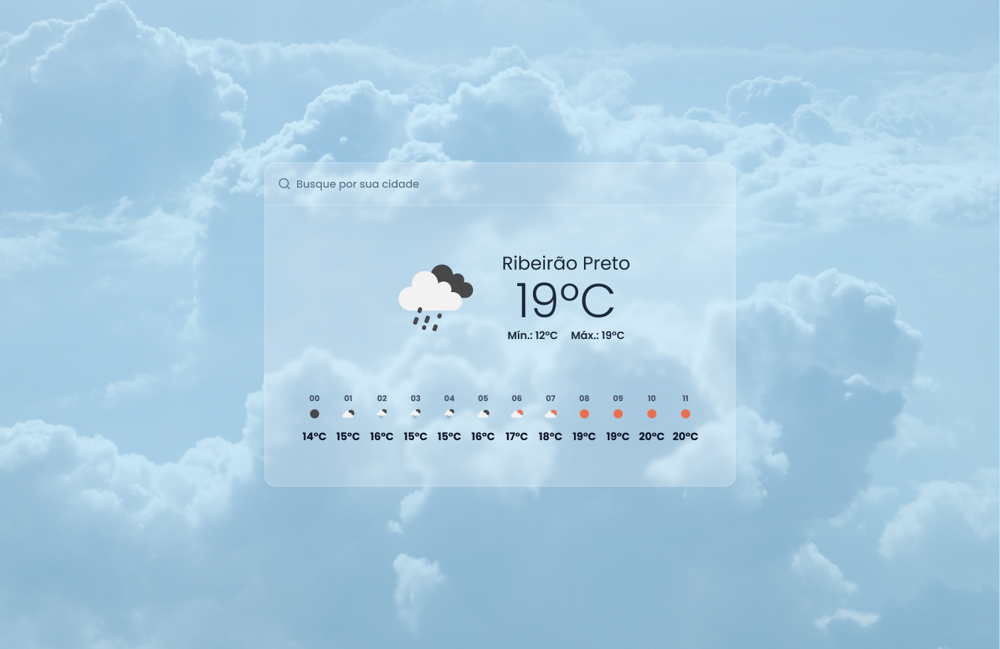
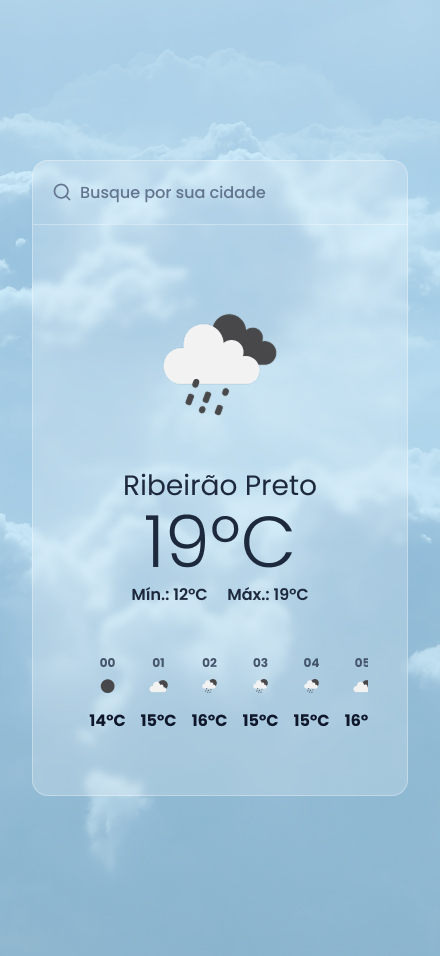

# 🌤️ Weather Forecast Widget

Este projeto é um experimento de integração com a API da OpenWeatherMap, com foco em exibir a **temperatura atual** e a **previsão para as próximas 12 horas** com base na cidade pesquisada. O design foi criado no Figma e desenvolvido com **Next.js** e **TailwindCSS**.

## 🔍 Funcionalidade

- Campo de busca por cidade
- Exibição da temperatura atual e condição climática
- Lista com a previsão horária das próximas 12 horas
- Layout responsivo e visual moderno

## 📷 Layout




O layout foi idealizado para oferecer uma interface amigável, informativa e elegante, seguindo os princípios de **UX/UI modernos**. O design está disponível em Figma como parte do processo de concepção visual.

## 🚀 Tecnologias Utilizadas

- **Next.js** — Framework React com renderização server-side e otimizações avançadas
- **TailwindCSS** — Utilitário CSS para estilização rápida e semântica
- **OpenWeatherMap API** — Integração para dados meteorológicos em tempo real
- **TypeScript** — Tipagem estática para maior confiabilidade no código

## 🧠 Objetivo do Projeto

Este projeto faz parte do meu portfólio como designer e desenvolvedor web, com foco em:

- Testar e demonstrar integração com APIs externas
- Aplicar boas práticas de design responsivo e acessibilidade
- Aperfeiçoar o fluxo de consumo de dados assíncronos em tempo real
- Unir design no Figma com implementação técnica fiel

## 📦 Como executar

1. Clone o repositório:

```bash
git clone https://github.com/seu-usuario/weather-widget.git
cd weather-widget

npm install
# ou
yarn
```

#### Criar arquivo .env

PRIVATE_KEY_API_WEATHER=your_api_key_here
URL_API_WEATHER=https://api.openweathermap.org/data

```bash
npm run dev
# ou
yarn dev
```

#### 📫 Contato

Se quiser conversar sobre design, front-end ou colaborações:
• Portfólio: (https://netoliveira.com)
• [linkedin.com/in/seu-netoliveira](https://www.linkedin.com/in/netoliveira/)
• Email: neto@netoliveira.com
